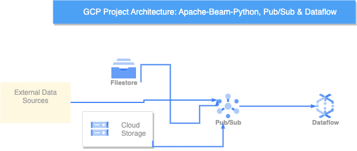

# GCP-Project-using-Building-Data-Pipeline-using-Apache-Beam-Python-Pub-Sub-and-Dataflow

I built the data pipeline for this project using Apache Beam, Python, Pub/sub, and Dataflow.

# Modules to Install

- Install Python wheel by running the following command:
- pip install wheel
- Install the latest version of the Apache Beam SDK for Python by running the following command from a virtual environment:
- pip install 'apache-beam[gcp]'
